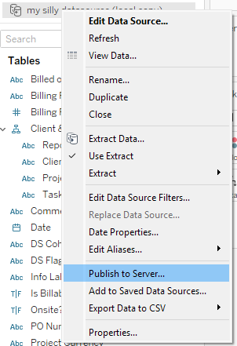
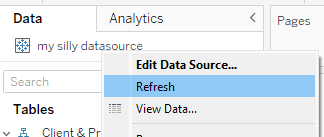

Goal:
Re-publish a datasource used in a workbook without 'baking in' the calculations.

Why:
So you can still edit the calculations
Preventing build up of

# Why you should care

Your workbook has duplicate named fields, some locked, some editable with terrible names like `[Sales copy (6) Fred edit final]` to distinguish from `[Sales final DoNotUse]`. This is incredibly confusing to work from and distances yourself from the single source of truth we all desire.

Eventually you will need to fix this issue so that the workbook can be developed efficiently and this will waste resources.

The good news is it's easy to prevent. Let's get stuck in.

# How it happens

Firstly, how did we even get to this mess? What led us to get here is often an unclear order of operations to update a published datasource. It's easy to do and I'd expect many beginner users to fall into this trap.

So let's say we have a Tableau workbook on Cloud/Server and we are tasked to update the datasource. We need to switch it over to look at a slightly different table in our database or update the custom SQL.

So we open the workbook in Desktop, edit the datasource and then republish. All is well and our datasource is updated. WRONG. DO NOT DO THIS.

You have just published the datasource, but along with it all of the calculations in your workbook. These calculations are no longer a property of the workbook but instead a property of the published datasource. They are no longer editable in the workbook.

The calculations must stay a part of the workbook if you want them to remain editable.

# How to fix it

Once you're in this mess, it is fixable and I will now walk you through it.

1. Open Tableau Desktop
2. Connect to published **DATASOURCE** from Tableau Cloud/Server
   
3. Create local copy of datasource
   
   You should now have a new datasource:
   
4. In the data pane, filter for calculations
   
5. Delete the calculated fields
6. Publish your new datasource over your original datasource
   
7. Now go back to your original workbook that uses the datasource you are editing and refresh the datasource connection
   
8.

# How to never let it happen in the first place
