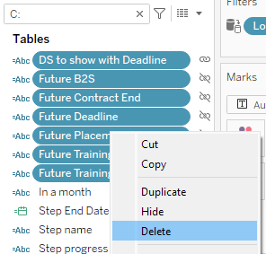

# Why you should care

Your workbook has duplicate named fields, some locked, some editable with terrible names like `[Sales copy (6) Fred edit final]` to distinguish from `[Sales final DoNotUse]`. This is **incredibly confusing** to work from and distances yourself from the single source of truth we all desire.

**Eventually** you will need to fix this issue so that the workbook can be developed efficiently and this will waste resources.

**The good news is it's easy to prevent**. Let's get stuck in.

# How it happens

Firstly, how did we even get to this mess? What led us to get here is often an unclear order of operations to update a published datasource. It's easy to do and I'd expect **many beginner users to fall into this trap**.

So let's say we have a Tableau workbook on Cloud/Server and we are tasked to update the datasource. We need to switch it over to look at a slightly different table in our database or update the custom SQL.

So we open the workbook in Desktop, edit the datasource and then republish. All is well and our datasource is updated. WRONG. **DO NOT DO THIS.**

You have just published the datasource, but along with it all of the calculations in your workbook. These calculations are no longer a property of the workbook but instead a property of the published datasource. They are no longer editable in the workbook.

**The calculations must stay a part of the workbook if you want them to remain editable.
**

# How to fix it

Once you're in this mess, it is fixable and I will now walk you through it.

1. Open the workbook that uses the datasource (this will be used in step #9)
2. Open a blank Tableau Desktop
3. Connect to published **DATASOURCE** from Tableau Cloud/Server
   
4. Create local copy of datasource

   

   4.1 You should now have a new datasource:

   

5. In the data pane, filter for calculations

   

6. Delete the calculated fields (also groups and sets)
   
7. Publish your new datasource over your original datasource
   
8. Now open another copy of your original workbook that uses the datasource you are editing and refresh the datasource connection. This is the workbook we will publish at the end of the process.
   
9. Now you will have lots of missing fields as the datasource no longer contains the calculations. We now need to copy the calculations over from the workbook we opened in step #1.
   1. Navigate to workbook opened in step #1
   2. Filter for the calculated fields
   3. Copy calculated fields
   4. Navigate back to 'datasource editing workbook' and paste calculated fields
   5. Go through each missing field, right click and select 'replace references' to point to the field you just copied
   6. Continue until all are copied over and replaced, elimating all the 'missing field' warnings.
   7. You may also need to fix colour palletes
10. Test you can now edit your calculations

# How to never let it happen in the first place

And that wasn't very fun was it?

So what can I remember to not get in this pickle again. Put simply:

- Never publish a datasource from your workbook with calculations
  or
- Never publish a datasource when it contains calculations

**If you need to edit a datasource, open Tableau Desktop, connect to the published datasource, make your changes and publish back to Server/Cloud.** No need to have the workbook that **USES** the datasource open.

Your Tableau developers or future self will be thankful, or in other words, you'll be **minimising technical debt**.
